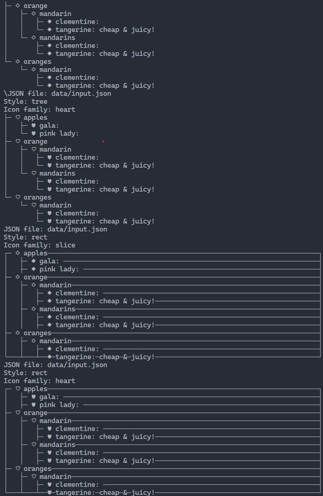
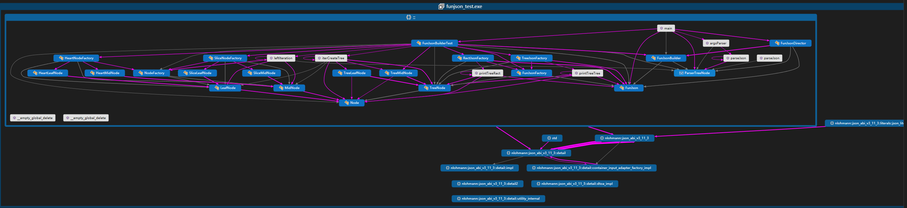
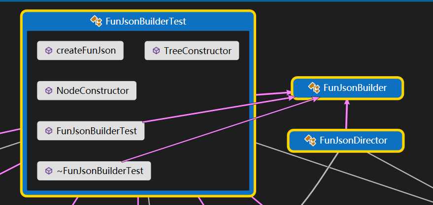
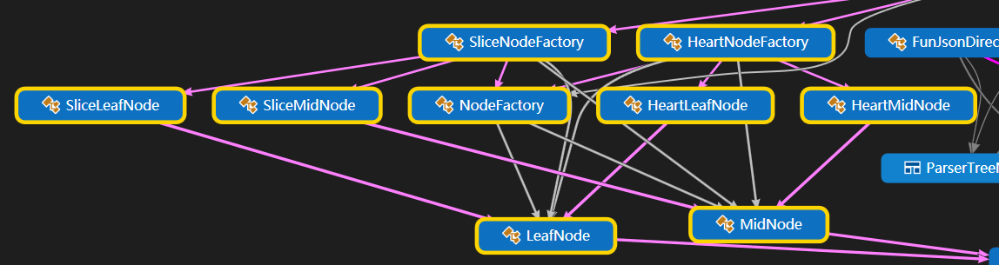
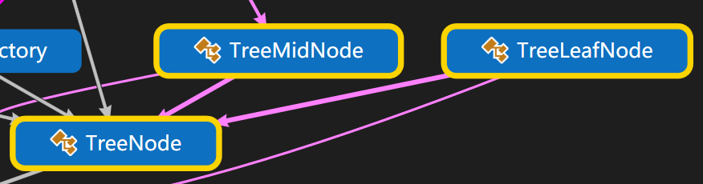
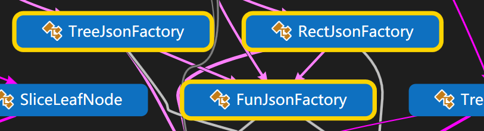

# FunJson

## 如何运行本项目？
如果要检验本项目结果，只需要运行run.sh即可。
如果想测试本项目对于不同json文件的解析效果，可以修改data目录下的json文件，然后运行run.sh。
重新编译请清空build目录后使用cmake命令重新生成。

## 运行结果

## 设计模式

详细介绍项目使用的设计模式

本项目类图使用Visual Studio 2019绘制，并使用自带代码图绘制功能完成，对于每一类的具体包含内容，可以使用Visual Studio打开**CodeMap.dgml**文件点击节点查看具体内容。

所使用的四种设计模式，引入图像请注意黄色边框的高亮类部分以便更好理解

**建设者模式**

我们通过一个建造者完成了对FunJson组成的抽象，分别是节点建设，树形构造和格式输出三部分，并且有抽象建造者和本次使用的具体建造者。

**抽象工厂模式**

在这一部分，我们使用方片和心形两个工厂完成第一步节点建设，每个工厂用于生产具有同一类符号的一类产品，也就是对应的叶子结点和中间节点，而产品本身也是继承自抽象类叶子结点和中间结点，组成了典型的抽象工厂模式。

**组合模式**

使用组合模式来使得树形结构的中间结点和叶子结点在接口上保持一致，这样可以使得树形结构的构造更加灵活。

**工厂方法模式**a

在第三部分格式输出时，我们只关心如何输出，而不关心具体的输出形式，因此我们使用工厂方法模式，将输出的具体实现交给子类完成，这样可以使得输出的形式可以灵活地扩展。
