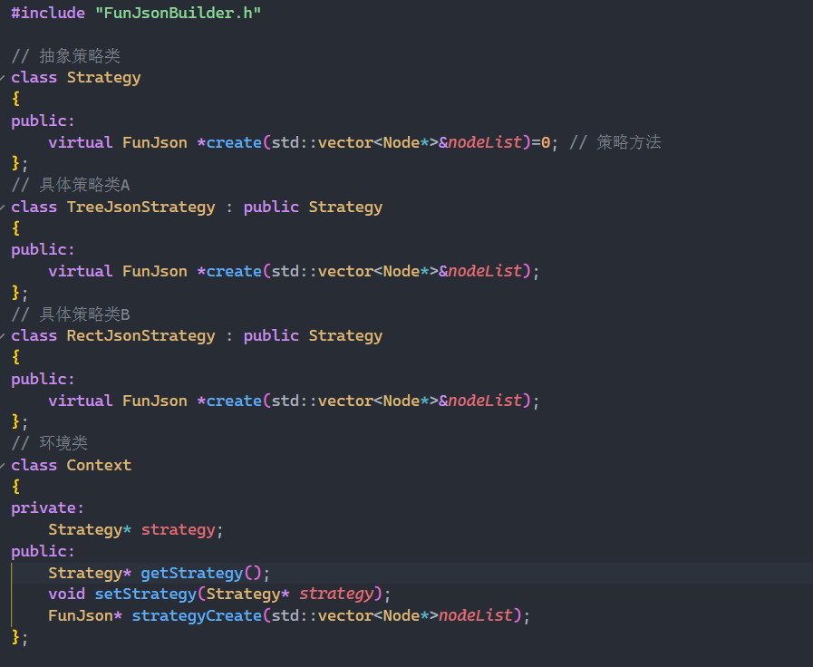
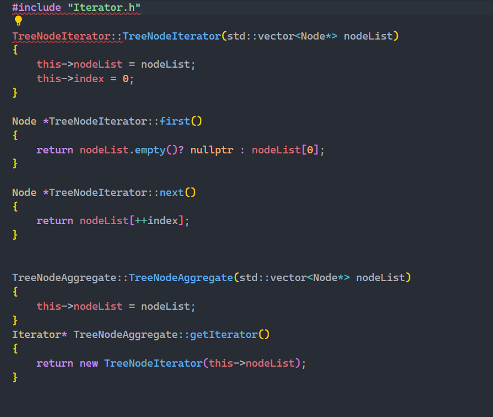

# FunJson

## 如何运行本项目？
如果要检验本项目结果，只需要运行run.sh即可。
如果想测试本项目对于不同json文件的解析效果，可以修改data目录下的json文件，然后运行run.sh。
重新编译请清空build目录后使用cmake命令重新生成。

## 运行结果
见output.txt文件。

## 设计模式
策略模式

迭代器模式

删除了使用组合模式的TreeNode改用迭代器模式进行遍历。
